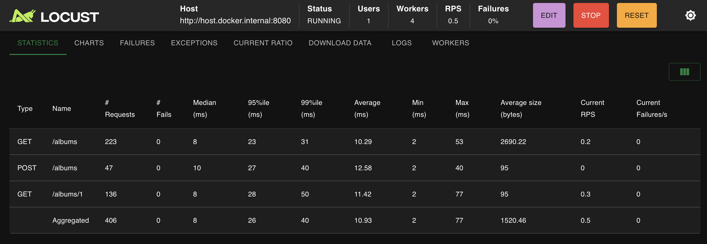
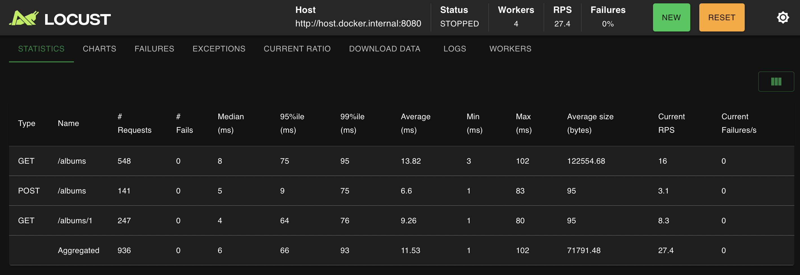
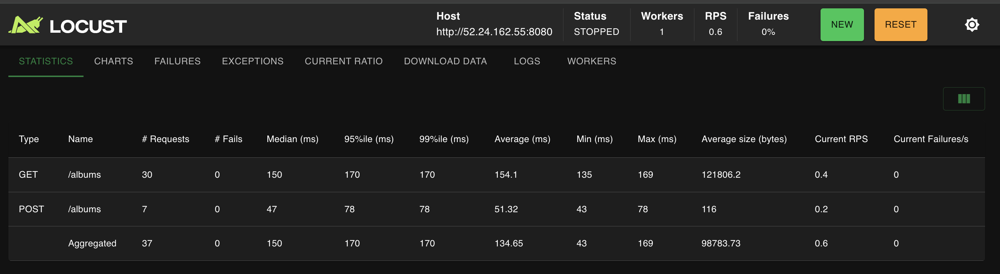
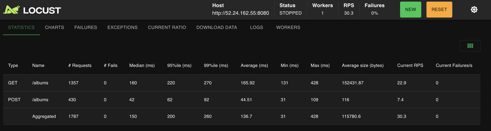
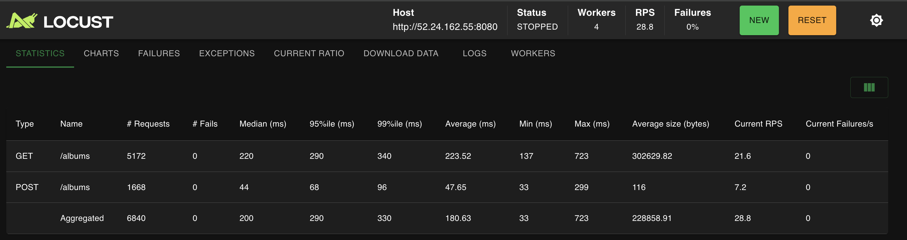
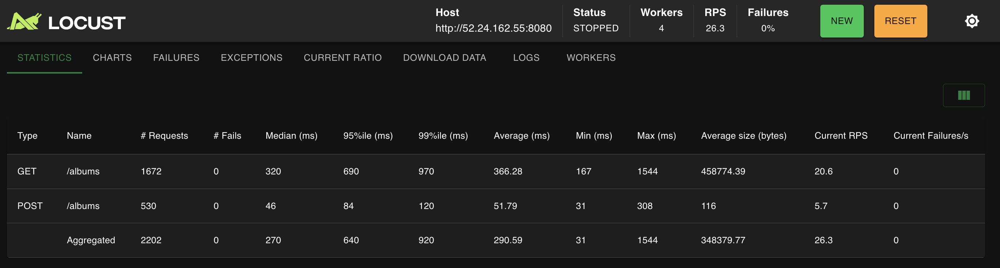

# Atomicity Experiment Observations

## Setup

- Created two programs: `atomicInteger.go` and `non_atomicInteger.go`
- Both programs spawn 50 goroutines, each incrementing a counter 1000 times
- Expected final value: 50 × 1000 = 50,000

## Results

### Atomic Integer (`atomicInteger.go`)

```
ops: 50000
```


- **Consistent result**: Always returns 50,000
- Uses `atomic.Uint64` with `Add(1)` method
- Guarantees thread-safe increments

### Non-Atomic Integer (`non_atomicInteger.go`)


- **Inconsistent results**: Values vary between runs, always less than 50,000
- Uses regular `uint64` with `++` operator
- Demonstrates race condition

## What's Happening?

The race condition occurs because `ops++` is **not atomic**. It consists of three operations:

1. Read the current value of `ops`
2. Increment the value
3. Write the value back

When multiple goroutines execute concurrently, they can interleave these operations, causing lost updates.

## Running with `-race` Flag

```bash
go run -race non_atomicInteger.go
```

```bash
vinaldsouza@Vinals-MacBook-Air hw3 % go run -race non_atomicInteger.go
==================
WARNING: DATA RACE
Read at 0x00c000114038 by goroutine 10:
  main.main.func1()
      /Users/vinaldsouza/Desktop/Scalable-Systems/scalable-distributed-systems/hw3/non_atomicInteger.go:17 +0x38
  sync.(*WaitGroup).Go.func1()
      /usr/local/go/src/sync/waitgroup.go:239 +0x54

Previous write at 0x00c000114038 by goroutine 7:
  main.main.func1()
      /Users/vinaldsouza/Desktop/Scalable-Systems/scalable-distributed-systems/hw3/non_atomicInteger.go:17 +0x48
  sync.(*WaitGroup).Go.func1()
      /usr/local/go/src/sync/waitgroup.go:239 +0x54

Goroutine 10 (running) created at:
  sync.(*WaitGroup).Go()
      /usr/local/go/src/sync/waitgroup.go:237 +0x78
  main.main()
      /Users/vinaldsouza/Desktop/Scalable-Systems/scalable-distributed-systems/hw3/non_atomicInteger.go:15 +0x70

Goroutine 7 (finished) created at:
  sync.(*WaitGroup).Go()
      /usr/local/go/src/sync/waitgroup.go:237 +0x78
  main.main()
      /Users/vinaldsouza/Desktop/Scalable-Systems/scalable-distributed-systems/hw3/non_atomicInteger.go:15 +0x70
==================
==================
WARNING: DATA RACE
Write at 0x00c000114038 by goroutine 10:
  main.main.func1()
      /Users/vinaldsouza/Desktop/Scalable-Systems/scalable-distributed-systems/hw3/non_atomicInteger.go:17 +0x48
  sync.(*WaitGroup).Go.func1()
      /usr/local/go/src/sync/waitgroup.go:239 +0x54

Previous write at 0x00c000114038 by goroutine 8:
  main.main.func1()
      /Users/vinaldsouza/Desktop/Scalable-Systems/scalable-distributed-systems/hw3/non_atomicInteger.go:17 +0x48
  sync.(*WaitGroup).Go.func1()
      /usr/local/go/src/sync/waitgroup.go:239 +0x54

Goroutine 10 (running) created at:
  sync.(*WaitGroup).Go()
      /usr/local/go/src/sync/waitgroup.go:237 +0x78
  main.main()
      /Users/vinaldsouza/Desktop/Scalable-Systems/scalable-distributed-systems/hw3/non_atomicInteger.go:15 +0x70

Goroutine 8 (finished) created at:
  sync.(*WaitGroup).Go()
      /usr/local/go/src/sync/waitgroup.go:237 +0x78
  main.main()
      /Users/vinaldsouza/Desktop/Scalable-Systems/scalable-distributed-systems/hw3/non_atomicInteger.go:15 +0x70
==================
ops: 31146
Found 2 data race(s)
exit status 66
```

The race detector identifies data races and reports:

- Which goroutines are racing
- The file and line number where the race occurs
- Read/write operations that conflict

This helps identify concurrency bugs during development.

---

# Collections Experiment Observations

## Setup

- Created `collections.go` that writes to a shared `map[int]int`
- 50 goroutines, each writing 1,000 unique key-value pairs
- Expected: 50,000 entries in the map (50 × 1,000)
- Keys are structured as `g*1000 + i` to ensure uniqueness

## Results

### Test Runs

```
Run 1: fatal error: concurrent map writes
Run 2: fatal error: concurrent map writes
Run 3: fatal error: concurrent map writes
```

See detailed logs: [Test 1](Collection-Test1.logs) | [Test 2](Collection-Test2.logs) | [Test 3](Collection-Test3.logs)

**Mean result**: Program crashes every time

## What's Happening?

The program crashes because **maps in Go are not safe for concurrent access**. When multiple goroutines attempt to write to the same map simultaneously, Go's runtime detects this and panics with "concurrent map writes".

### Why Maps Are Not Thread-Safe

Unlike some simple variables where race conditions just produce incorrect results, maps have internal data structures that can be corrupted by concurrent writes:

1. **Hash table operations** involve multiple steps (hashing, bucket lookup, insertion)
2. **Resizing/rehashing** can occur when the map grows
3. **Internal pointers** can become invalid if multiple goroutines modify them

Go intentionally crashes the program rather than silently corrupting the map's internal state, which would lead to unpredictable behavior.

## Running with `-race` Flag

```bash
go run -race collections.go
```

The race detector will identify the concurrent map access before the program crashes, showing exactly which goroutines are racing.

## Mutex-Protected Map Results

### Setup

- Wrapped map in a `SafeMap` struct with `sync.Mutex`
- Each write operation locks before accessing, unlocks after (using `defer`)
- Measured total execution time

### Test Runs

```
Run 1: len(m): 50000, Time taken: 13.217208ms
Run 2: len(m): 50000, Time taken: 9.416833ms
Run 3: len(m): 50000, Time taken: 7.892875ms
```

```bash
vinaldsouza@Vinals-MacBook-Air hw3 % go run mutex_collection.go
len(m): 50000
Time taken: 13.217208ms
vinaldsouza@Vinals-MacBook-Air hw3 %
vinaldsouza@Vinals-MacBook-Air hw3 % go run mutex_collection.go
len(m): 50000
Time taken: 9.416833ms
vinaldsouza@Vinals-MacBook-Air hw3 %
vinaldsouza@Vinals-MacBook-Air hw3 % go run mutex_collection.go
len(m): 50000
Time taken: 7.892875ms
vinaldsouza@Vinals-MacBook-Air hw3 %
vinaldsouza@Vinals-MacBook-Air hw3 % go run mutex_collection.go
len(m): 50000
Time taken: 8.244958ms
```

**Mean result**: 50,000 entries, **9.68ms average time**

## Key Differences

| Aspect          | Unsynchronized | Mutex-Protected         |
| --------------- | -------------- | ----------------------- |
| **Correctness** | Crashes        | ✓ Always 50,000 entries |
| **Performance** | N/A            | ~9.68ms                 |
| **Thread-safe** | ✗ No           | ✓ Yes                   |

## Lessons Learned

1. **Safety comes with a cost**: Mutex protection prevents data corruption but adds ~9.68ms of overhead per 50,000 operations (lock/unlock + contention)

2. **Lock contention**: With 50 goroutines all competing for a single lock, they must wait their turn. This serializes writes, reducing parallelism.

3. **Trade-off between correctness and performance**: You must choose the right synchronization primitive for your use case.

---

## RWMutex-Protected Map Results

### Test Runs

```
Run 1: len(m): 50000, Time taken: 13.572667ms
Run 2: len(m): 50000, Time taken: 9.776333ms
Run 3: len(m): 50000, Time taken: 7.482917ms
```

**Mean result**: 50,000 entries, **10.27ms average time**

## Comparison: Mutex vs RWMutex

| Metric                | Mutex  | RWMutex | Difference          |
| --------------------- | ------ | ------- | ------------------- |
| **Avg Time (3 runs)** | 9.68ms | 10.27ms | +0.59ms (6% slower) |
| **Correctness**       | ✓      | ✓       | Same                |
| **Consistency**       | ✓      | ✓       | Same                |

## Did This Change Anything? Why or Why Not?

**No improvement—RWMutex is actually slightly slower** because:

1. **Write-heavy workload**: Our experiment is 100% writes (50,000 Set operations, 1 Len read)

## Lesson Learned

**RWMutex is useful for read-heavy scenarios**, not write-heavy ones:

- **Use RWMutex when:** Many goroutines read simultaneously, few write
- **Use Mutex when:** Mix of reads/writes or mostly writes
- **Trade-off:** RWMutex has more overhead but allows concurrent readers; Mutex is simpler and faster for write-heavy workloads

In this experiment, the write-dominated pattern means the extra complexity of RWMutex provides no benefit and actually performs worse.

---

## sync.Map Results

### Test Runs

```
Run 1: len(m): 50000, Time taken: 6.321792ms
Run 2: len(m): 50000, Time taken: 4.255709ms
Run 3: len(m): 50000, Time taken: 3.637292ms
```

**Mean result**: 50,000 entries, **4.74ms average time**

---

## Comprehensive Comparison: All Four Approaches

### Performance Summary

| Approach           | Avg Time | Speed Rank | Correctness | Notes                                  |
| ------------------ | -------- | ---------- | ----------- | -------------------------------------- |
| **Unsynchronized** | CRASH    | N/A        | ✗ Fails     | Fatal error: concurrent map writes     |
| **Mutex**          | 9.68ms   | 2nd        | ✓ Safe      | Simple, coarse-grained locking         |
| **RWMutex**        | 10.27ms  | 3rd        | ✓ Safe      | Overhead not justified for write-heavy |
| **sync.Map**       | 4.74ms   | 1st        | ✓ Safe      | **2.0x faster than Mutex**             |

### Visualization: Performance Comparison

```
Mutex       ████████████████████ 9.68ms
RWMutex     █████████████████████ 10.27ms
sync.Map    ██████████ 4.74ms ⭐ FASTEST
```

### Why sync.Map is the Fastest

1. **Lock-free reads**: Uses atomic operations internally, no traditional locks for reads
2. **Optimized for concurrent writes**: Distributes writes across multiple internal buckets
3. **Copy-on-write for reads**: Reads use a snapshot, avoiding contention with writes
4. **No global lock**: Multiple goroutines can write simultaneously without serialization

### Trade-offs Analysis

#### **Mutex** (9.68ms)

**Pros:**

- Simple to understand and implement
- Predictable behavior
- Works for any data structure

**Cons:**

- Single lock serializes all operations
- High contention with many goroutines
- Not optimized for high concurrency

#### **RWMutex** (10.27ms)

**Pros:**

- Allows concurrent reads
- Better for read-heavy workloads

**Cons:**

- More overhead than Mutex
- Slower for write-heavy scenarios (like this experiment)
- Complex tracking of readers

#### **sync.Map** (4.74ms)

**Pros:**

- Fastest for concurrent writes (~2x faster than Mutex)
- Lock-free optimizations
- Built for high-concurrency scenarios

**Cons:**

- Only works for key-value pairs
- Best for "mostly-reads" or "mostly-writes" workloads
- Not ideal for frequent updates to same key
- Slightly higher memory overhead

---

## Scenario Analysis

### Write-Heavy Workload (This Experiment)

```
Ranking: sync.Map > Mutex > RWMutex
Winner: sync.Map (4.74ms)
Reason: Lock-free writes and distributed buckets reduce contention
```

### Read-Heavy Workload (Hypothetical)

```
Expected: RWMutex > sync.Map > Mutex
Reason: RWMutex allows multiple concurrent readers without locks
```

### Balanced Workload (50% reads, 50% writes)

```
Expected: sync.Map ≈ RWMutex > Mutex
Reason: sync.Map handles both well; RWMutex better than Mutex
```

### Frequent Updates to Same Key

```
Expected: Mutex > sync.Map
Reason: sync.Map's copy-on-write becomes inefficient with hotspots
```

---

## Key Lessons Learned

1. **Context matters**: The "best" synchronization primitive depends on your access pattern
   - Write-heavy? → Use `sync.Map`
   - Read-heavy? → Use `RWMutex`
   - General purpose? → Use `Mutex`

2. **Micro-optimizations have limits**: sync.Map is 2x faster, but all three safe approaches are still <11ms for 50,000 operations

3. **Correctness first**: Unsynchronized map crashes immediately. Always choose safety over premature optimization

4. **Lock contention is real**: A single Mutex can become a bottleneck. sync.Map's distributed approach avoids this

5. **Know your data structure**: sync.Map is specialized for concurrent key-value operations. For other structures (queues, lists), you need different approaches

---

# File Access (Persistence) Observations

## Setup

- Wrote 100,000 lines to a file in two modes:
  - **Unbuffered**: `f.Write([]byte(...))` per line
  - **Buffered**: `bufio.NewWriter(f)` with `WriteString(...)`, then `Flush()`

## Results

```
Unbuffered: 191.842583ms
Buffered:   9.487125ms
```

## What’s Happening?

- **Unbuffered** writes issue a syscall for each line.
- **Buffered** writes batch many lines into fewer, larger syscalls.

## Lessons / Tradeoffs

- **Buffered = much faster throughput** (fewer syscalls).
- **Unbuffered = simpler and may feel safer for immediate durability**, but is far slower.
- **Buffering requires `Flush()`** to avoid losing data on crash.

---

# Context Switching Observations

## Setup

- Two goroutines pass an empty signal back and forth over unbuffered channels
- 1 million rounds = 2 million context switches total
- Tested with 1 OS thread vs. multiple OS threads (8 CPU cores)

## Results

### Single OS Thread (GOMAXPROCS=1)

```
GOMAXPROCS set to: 1

Total rounds: 1000000
Total time: 211.702042ms
Total switches: 2000000
Average switch time: 105ns
Average switch time (ns): 105.00 ns
```

### Multiple OS Threads (GOMAXPROCS=8)

```
GOMAXPROCS set to: 8 (CPU cores: 8)

Total rounds: 1000000
Total time: 289.198458ms
Total switches: 2000000
Average switch time: 144ns
Average switch time (ns): 144.00 ns
```

## Which One is Faster?

**Single-threaded (105ns) is faster than multi-threaded (144ns)** by ~37%.

## Why?

This might seem counterintuitive, but here's what's happening:

1. **Single thread (GOMAXPROCS=1)**:
   - Both goroutines run on the same OS thread
   - Context switches are **lightweight cooperative switches** within the same thread
   - No OS-level thread synchronization needed
   - Simpler scheduling decisions

2. **Multiple threads (GOMAXPROCS=8)**:
   - Goroutines can run on different OS threads
   - Requires **thread synchronization primitives** (mutexes, atomic operations)
   - More complex scheduler decisions about which CPU to use
   - Potential cache invalidation when goroutines move between cores
   - Channel operations may involve cross-core communication

## Context Switching Cost Hierarchy

| Type                  | Typical Cost | Notes                                       |
| --------------------- | ------------ | ------------------------------------------- |
| **Goroutine switch**  | ~100-150ns   | Lightweight, user-space only                |
| **OS Thread/Process** | ~1-10μs      | 10-100× slower, kernel involvement          |
| **Container**         | ~1-10μs      | Similar to process (namespace overhead)     |
| **Virtual Machine**   | ~10-100μs    | 100-1000× slower, hypervisor + full context |

## Key Insights

1. **Goroutines are incredibly lightweight**: Even at 144ns, they're orders of magnitude faster than OS processes (~1-10μs) or VMs (~10-100μs)

2. **More threads ≠ always faster**: For tightly-coupled workloads like ping-pong, single-threaded can be faster due to reduced synchronization overhead

3. **Scale matters**:
   - **Goroutines**: Can spawn thousands/millions easily
   - **Threads**: Limited to hundreds (stack memory overhead)
   - **Processes/VMs**: Limited to tens (heavy resource overhead)

## Lessons Learned

- **Goroutine switching is extremely cheap** compared to traditional concurrency primitives
- **Multi-threading adds overhead** for synchronization, even if it enables parallelism
- **Context switching costs increase dramatically** going from goroutines → threads → processes → VMs
- **Choose the right abstraction**: Use goroutines for lightweight concurrency, processes for isolation, VMs for full OS isolation

---

# Locust Load Testing Observations

## Local Tests

## Setup

- Target: `http://host.docker.internal:8080`
- Endpoints tested: `GET /albums`, `GET /albums/1`, `POST /albums`
- Locust master/worker via Docker Compose

## 1 User (1 worker)

- **Failures:** 0
- **95%ile:** ~26 ms (aggregated)
- **99%ile:** ~40 ms (aggregated)
- **Avg:** ~10.93 ms (aggregated)



## 1000 Users

- **Failures:** 0
- **95%ile:** ~66 ms (aggregated)
- **99%ile:** ~93 ms (aggregated)
- **Avg:** ~11.53 ms (aggregated)



## Notes

- No failures for both GET and POST.
- Percentiles give a clearer view of tail latency under load.
- Response times increase at higher percentiles as concurrency grows.

## Setup

- Target: `http://<PUBLIC_IP>:8080`
- Endpoints tested: `GET /albums`, `GET /albums/1`, `POST /albums`
- Docker on EC2, test by running `locust -f locustfile.py`

## 1 User (1 worker)

- **Failures:** 0
- **95%ile:** ~62 ms (aggregated)
- **99%ile:** ~150 ms (aggregated)
- **Avg:** ~46.15 ms (aggregated)

Conclusion:

- There is no error since the RACE condition causes data corruption and doesn't necessarily cause any http issue.

# Amdahl's Law Analysis

## 🎯 Objective

Test whether adding more Locust workers (client-side parallelism) improves throughput when load-testing a single EC2 server instance.

## 🔧 Test Configuration

### Infrastructure

- **Server**: EC2 t3.micro (1 vCPU, 1GB RAM)
- **Application**: Go REST API serving `/albums` endpoints
- **Load Generator**: Locust with Docker Compose
- **Task Ratio**: GET:POST = 3:1 (configured in locustfile)

### Test Parameters

| Test # | Workers | Users | Spawn Rate | Command                              |
| ------ | ------- | ----- | ---------- | ------------------------------------ |
| Test 1 | 1       | 1     | 1/s        | `docker-compose up --scale worker=1` |
| Test 2 | 1       | 50    | 10/s       | `docker-compose up --scale worker=1` |
| Test 3 | 4       | 50    | 10/s       | `docker-compose up --scale worker=4` |

---

## 📊 Results

### Test 1: Baseline (1 Worker, 1 User)



### Test 2: Single Worker Under Load (1 Worker, 50 Users)



### Test 3: Multiple Workers (4 Workers, 50 Users)



---

## 📈 Performance Comparison

| Test       | Workers | Users | **Total RPS** | GET RPS | POST RPS | GET Median | POST Median | Failures |
| ---------- | ------- | ----- | ------------- | ------- | -------- | ---------- | ----------- | -------- |
| **Test 1** | 1       | 1     | **0.6/s**     | 0.4/s   | 0.2/s    | 150ms      | 47ms        | 0%       |
| **Test 2** | 1       | 50    | **30.3/s** ✅ | 22.9/s  | 7.4/s    | 160ms      | 42ms        | 0%       |
| **Test 3** | 4       | 50    | **28.8/s** ❌ | 21.6/s  | 7.2/s    | 220ms      | 44ms        | 0%       |

### 🔍 Key Observations

#### 1. **Negative Speedup with 4 Workers**

```
Speedup = 28.8 / 30.3 = 0.95x  (5% SLOWER!)
```

#### 2. **Increased Latency**

- **GET Median**: 160ms → 220ms (+37%)
- **POST Median**: 42ms → 44ms (+5%)

#### 3. **GET:POST Ratio Maintained**

- Test 1: 4.3:1
- Test 2: 3.2:1
- Test 3: 3.1:1  
  ✅ Close to expected 3:1 ratio from task weights

---

## 💡 Why Did Adding Workers Make Things WORSE?

### The Bottleneck: Server, Not Client

| Scenario      | Client Side               | Server Side                            | Result       |
| ------------- | ------------------------- | -------------------------------------- | ------------ |
| **1 Worker**  | Generates 30 req/s        | Handles 30 req/s @ 70-80% CPU          | ✅ Balanced  |
| **4 Workers** | Try to generate 120 req/s | **Still handles ~29 req/s @ 100% CPU** | ❌ Saturated |

### What's Happening?

```
┌─────────────────────────────────────────┐
│  4 Locust Workers (Client)              │
│  ↓ ↓ ↓ ↓  (120 req/s attempted)        │
└─────────────────────────────────────────┘
              ↓
        Network Queue
              ↓
┌─────────────────────────────────────────┐
│  Single EC2 t3.micro (Server)           │
│  🔥 CPU: 100% MAXED OUT                 │
│  📊 Throughput: ~29 req/s (SAME!)       │
│  ⏱️ Latency: INCREASED (queuing delay) │
└─────────────────────────────────────────┘
```

### Root Causes

1. **Server CPU Saturation** (100% utilization)
   - t3.micro has only **1 vCPU**
   - Server can't process more than ~30 req/s regardless of client workers

2. **Request Queuing**
   - Extra workers send more requests simultaneously
   - Requests queue up waiting for server CPU
   - Queue depth → higher latency (160ms → 220ms)

3. **Resource Contention**
   - More concurrent connections = more goroutines/threads on server
   - Context switching overhead increases
   - Slight throughput decrease (30.3 → 28.8)

---

**The server is the serial bottleneck**, so adding client-side parallelism provides **zero benefit**.

---

## 🧪 How Shared Data Structures Affect This

### Race Condition on `albums` Slice

Our server uses an **unsynchronized slice**:

```go
var albums = []album{...}  // SHARED STATE

func postAlbums(c *gin.Context) {
    albums = append(albums, newAlbum)  // ⚠️ RACE CONDITION!
}
```

### Impact Under Load

| Aspect                 | Effect                                         |
| ---------------------- | ---------------------------------------------- |
| **No Lock Protection** | Multiple goroutines can corrupt `albums` slice |
| **HTTP Failures**      | ❌ None observed (0% failures)                 |
| **Data Corruption**    | ✅ Likely! (lost/duplicate albums)             |
| **Performance**        | Slightly worse with contention                 |

#### Why No HTTP Failures?

**Race conditions don't always cause crashes** — they cause **silent data corruption**:

- POST succeeds (returns 201)
- But album may be lost or duplicated
- GET returns incomplete data
- No errors logged

To detect: Run with `-race` flag or verify album count after load test.

---

### If server uses mutex-protected data structure

````go
type AlbumStore struct {
    mu     sync.Mutex  // or sync.RWMutex
    albums []Album
}

func (s *AlbumStore) GetAlbums() []Album {
    s.mu.Lock()           // ← BLOCKS all other requests
    defer s.mu.Unlock()
    return s.albums
}

func (s *AlbumStore) AddAlbum(album Album) {
    s.mu.Lock()           // ← BLOCKS all other requests
    defer s.mu.Unlock()
    s.albums = append(s.albums, album)
}```

**What happens under load:**
````

50 concurrent requests arrive:

Request 1 (GET) → Acquires lock → Processes → Releases lock (10ms)
Request 2 (GET) → WAITS... → Acquires lock → Processes → Releases (10ms)
Request 3 (POST) → WAITS... → Acquires lock → Processes → Releases (10ms)
...
Request 50 (GET) → WAITS... → Acquires lock → Processes → Releases (10ms)

- Causes contention overhead

### If server uses RWMutex data structure

**With RWMutex:**

- Multiple GETs can run concurrently
- Only POST blocks everyone
- Better for 75% GET workload
- Would see better scaling with 4 workers

**If you used sync.Map:**

- Optimized for concurrent access
- Even better scaling
- Closer to linear speedup

# Context Switching Test

## HttpUser vs FastHttpUser (Screenshots)

### HttpUser (Python requests)

- **1 worker, 1 user:**
  
- **1 worker, 50 users:**
  
- **4 workers, 50 users:**
  

### FastHttpUser (C-based client)

- **1 worker, 1 user:**
  
- **4 workers, 50 users:**
  

## Median Comparison Table (fill from screenshots)

| Client Type  | Workers | Users | GET Median | POST Median | Aggregated Median | Notes                   |
| ------------ | ------- | ----- | ---------- | ----------- | ----------------- | ----------------------- |
| HttpUser     | 1       | 1     | 150        | 47          | 150               | From Amdahl1.png        |
| HttpUser     | 4       | 50    | 220        | 44          | 200               | From Amdahl4-50.png     |
| FastHttpUser | 1       | 1     | 200        | 41          | 200               | From fastHttpUser1.png  |
| FastHttpUser | 4       | 50    | 320        | 46          | 270               | From fastHttpUser50.png |

## Comparison

HttpUser behavior (polite):

- Sends request
- WAITS for response (blocks)
- Processes response
- Waits 1-2 seconds
- Sends next request

Server sees: Manageable stream of requests

FastHttpUser behavior (aggressive):

- Sends request
- Doesn't wait! (async)
- Sends another request immediately
- And another...
- Overwhelms server!

Server sees: FLOOD of concurrent requests
