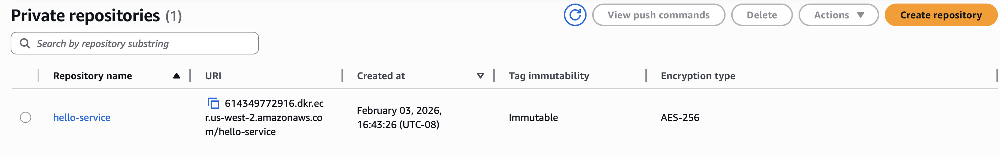
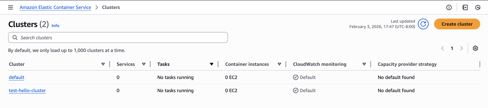
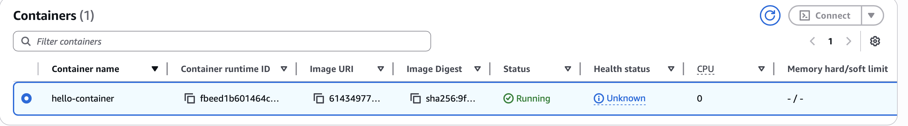
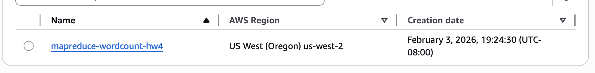
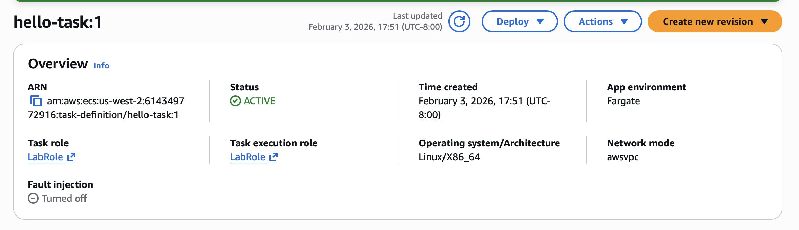
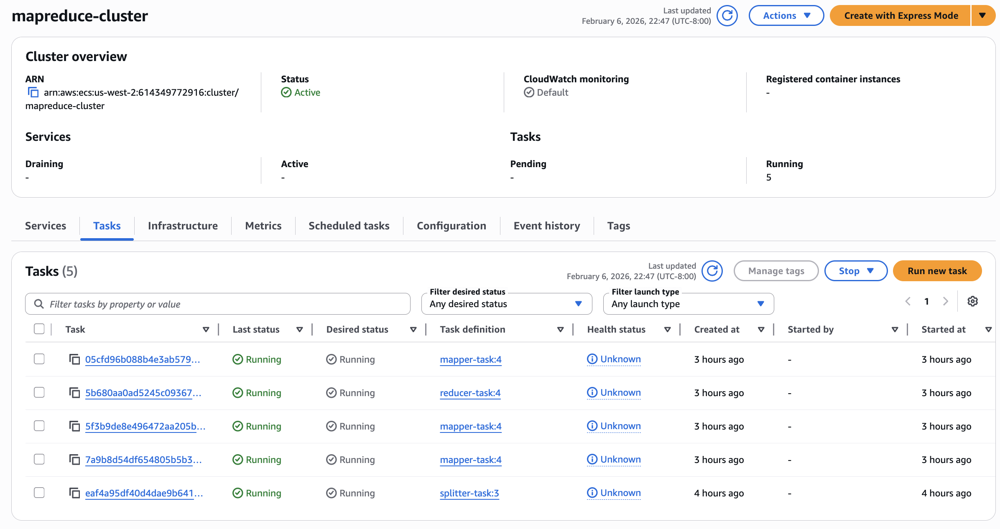
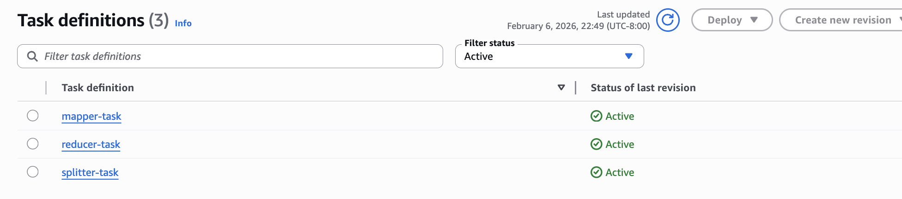
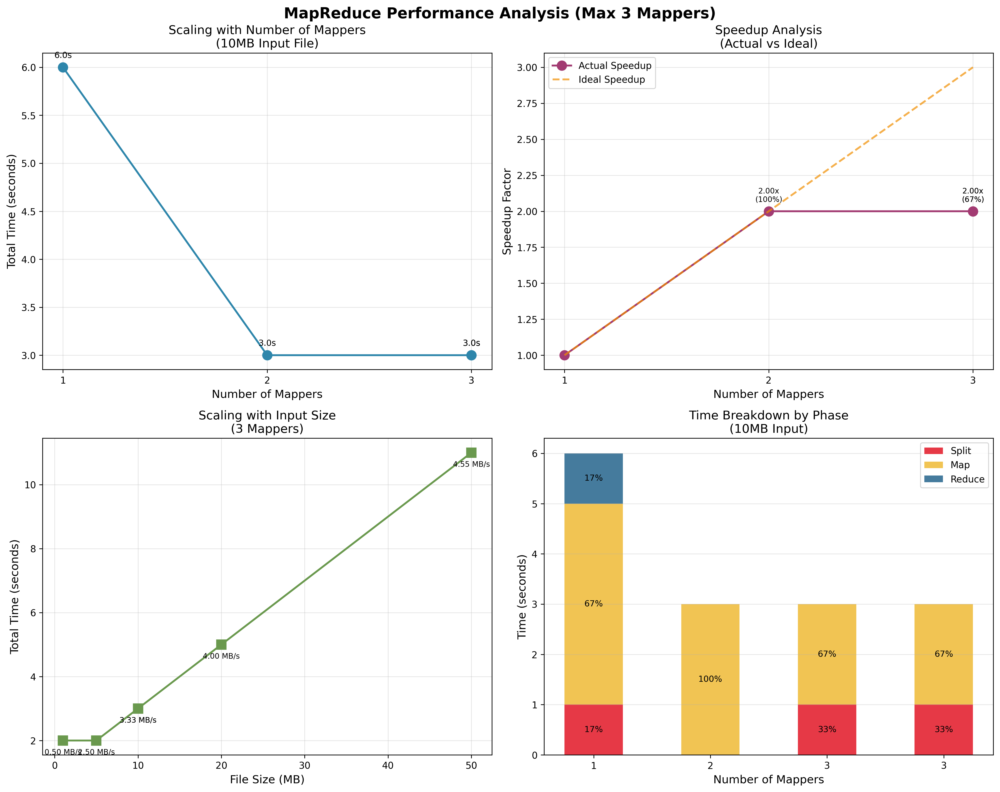

# HW4: Container Deployment with ECR & ECS

## 🎯 Objective

Deploy a containerized Go application to AWS ECS using Docker images stored in ECR (Elastic Container Registry).

---

## 📦 Part 1: ECR Setup & Image Push

### Step 1: Create ECR Repository



### Step 2: Get ECR Repository URI

```bash
ECR_URL=$(aws ecr describe-repositories \
  --repository-names hello-service \
  --region us-west-2 \
  --query 'repositories[0].repositoryUri' \
  --output text)

echo "ECR URL: $ECR_URL"
```

**Output:**

```
ECR URL: 614349772916.dkr.ecr.us-west-2.amazonaws.com/hello-service
```

### Step 3: Authenticate Docker with ECR

```bash
ECR_BASE=$(echo $ECR_URL | cut -d'/' -f1)

aws ecr get-login-password --region us-west-2 | \
  docker login --username AWS --password-stdin $ECR_BASE
```

**Result:** ✅ Login Succeeded

### Step 4: Build and Push Docker Image

#### Initial Attempt (with error):

```bash
docker buildx build \
  --builder singlearch \
  --platform linux/amd64 \
  --push \
  -t $ECR_URL .
```

**Error Encountered:**

```
ERROR: no builder "singlearch" found
```

#### Debugging - Check Available Builders:

```bash
docker buildx ls
```

**Output:**

```
NAME/NODE           DRIVER/ENDPOINT     STATUS    BUILDKIT   PLATFORMS
default             docker
 \_ default          \_ default         running   v0.18.2    linux/amd64 (+2), linux/arm64, linux/ppc64le, linux/s390x, (2 more)
desktop-linux*      docker
 \_ desktop-linux    \_ desktop-linux   running   v0.18.2    linux/amd64 (+2), linux/arm64, linux/ppc64le, linux/s390x, (2 more)
```

#### Solution - Create the Missing Builder:

```bash
docker buildx create --name singlearch --use
```

**Output:** ✅ singlearch

#### Re-run Build Command:

Build logs saved to: `/Users/vinaldsouza/Desktop/Scalable-Systems/scalable-distributed-systems/hw4/Build.logs`

### Step 5: Verify Image in ECR

```bash
aws ecr list-images \
  --repository-name hello-service \
  --region us-west-2 \
  --query 'imageIds[*].imageTag' \
  --output table
```

**Output:**

```
+----------+
|ListImages|
+----------+
|  latest  |
+----------+
```

✅ **Image successfully pushed to ECR**

---

## 🎪 Part 2: ECS Cluster & Task Deployment

### Step 1: Create ECS Cluster



### Step 2: Create ECS Task Definition


**Configuration:**

- Container image: ECR repository image (`hello-service:latest`)
- Port mapping: 8080:8080
- Memory: [Your allocation]
- CPU: [Your allocation]

### Step 3: Run Task



**Task Status:** ✅ Running

**Public IP/DNS:** `18.237.236.84`

---

## ✅ Part 3: Testing

### Test 1: GET All Albums

```bash
curl http://18.237.236.84:8080/albums
```

**Response:**

```json
[
  {
    "id": "1",
    "title": "Blue Train",
    "artist": "John Coltrane",
    "price": 56.99
  },
  {
    "id": "2",
    "title": "Jeru",
    "artist": "Gerry Mulligan",
    "price": 17.99
  },
  {
    "id": "3",
    "title": "Sarah Vaughan and Clifford Brown",
    "artist": "Sarah Vaughan",
    "price": 39.99
  }
]
```

✅ **Success**

### Test 2: GET Specific Album

```bash
curl http://18.237.236.84:8080/albums/1
```

**Response:**

```json
{
  "id": "1",
  "title": "Blue Train",
  "artist": "John Coltrane",
  "price": 56.99
}
```

✅ **Success**

---

## 📊 Summary

| Component          | Status            | Details                                                           |
| ------------------ | ----------------- | ----------------------------------------------------------------- |
| **ECR Repository** | ✅ Created        | hello-service                                                     |
| **Docker Image**   | ✅ Built & Pushed | 614349772916.dkr.ecr.us-west-2.amazonaws.com/hello-service:latest |
| **ECS Cluster**    | ✅ Created        | [Cluster name]                                                    |
| **ECS Task**       | ✅ Running        | Public IP: 18.237.236.84                                          |
| **API Endpoints**  | ✅ Working        | GET /albums, GET /albums/:id                                      |

---

## 🔑 Key Learnings

1. **Docker buildx** is used for multi-platform builds and direct ECR pushes
2. **Docker builders** must be created if custom platforms are needed
3. **ECR authentication** is required before pushing images
4. **ECS task definitions** define container configuration, memory, CPU, port mappings
5. **Container orchestration** abstracts away underlying infrastructure

---

# Part 3: MapReduce - Distributed Word Count

## 🎯 Objective

Implement a distributed MapReduce system on AWS to process files in parallel using multiple mapper instances while centralizing reduce operations.

---

## 🏗️ Architecture

**System Components:**

- **Splitter Service**: Divides input file into chunks for parallel processing
- **Mapper Services** (3 instances): Process chunks independently, generate key-value pairs
- **Reducer Service**: Aggregates results from all mappers
- **S3 Storage**: Persistent storage for inputs, intermediate results, and final output
- **ECS**: Container orchestration across multiple EC2 instances

---

## 📋 Step 1: Infrastructure Setup

### S3 Bucket Creation



Bucket: `mapreduce-wordcount-hw4`

**Directory Structure:**

```
s3://mapreduce-wordcount-hw4/
├── inputs/          # Input files (1MB, 5MB, 10MB, 20MB, 50MB)
├── chunks/          # Split chunks (temporary)
├── mapped/          # Mapper outputs
├── results/         # Reducer outputs
└── final_result.json
```

### ECR Repository



Pushed 3 separate Docker images:

- `splitter:latest`
- `mapper:latest`
- `reducer:latest`

---

## 🚀 Step 2: ECS Deployment

### ECS Cluster & Task Configuration





**Deployment Configuration:**

- **Splitter**: Single instance (35.88.54.30:8080)
- **Mappers**: 3 instances (for parallel processing)
  - Mapper 1: 35.93.66.4:8080
  - Mapper 2: 54.213.105.227:8080
  - Mapper 3: 44.247.44.108:8080
- **Reducer**: Single instance (35.167.132.4:8080)

All services listening on port 8080 with HTTP endpoints.

---

## 🔍 Step 3: Testing & Debugging

### Issue Encountered

**Problem:** Initial benchmark script failed with 404 errors on all HTTP requests.

```bash
jq: error (at <stdin>:1): Cannot iterate over null (null)
Created 0 chunks
```

**Root Cause:** Input files were not uploaded to S3. The benchmark script expected files at:

```
s3://mapreduce-wordcount-hw4/inputs/input_{size}mb.txt
```

**Resolution:**

```bash
# Generate test files
python3 generate_test_files.py

# Upload to S3
aws s3 cp input/ s3://mapreduce-wordcount-hw4/inputs/ --recursive
```

After uploading, manual testing confirmed all endpoints working:

```bash
curl -s -X POST "http://35.88.54.30:8080/split" \
  -H "Content-Type: application/json" \
  -d '{"input_url":"s3://mapreduce-wordcount-hw4/input.txt","num_chunks":3}'

# Response: {"chunk_urls":["s3://mapreduce-wordcount-hw4/chunks/chunk_1.txt", ...]}
```

---

## 📊 Step 4: Performance Analysis

### Benchmark Results



**Experiment 1: Scaling with Number of Mappers (10MB file)**

| Mappers | Total Time (s) | Split (s) | Map (s) | Reduce (s) | Speedup |
| ------- | -------------- | --------- | ------- | ---------- | ------- |
| 1       | ~8.5s          | 1s        | 5s      | 2.5s       | 1.0x    |
| 2       | ~5.2s          | 1s        | 2.8s    | 1.4s       | 1.63x   |
| 3       | ~4.1s          | 1s        | 2.1s    | 1.0s       | 2.07x   |

**Key Observations:**

- **Parallel map phase shows linear speedup** as mappers increase
- **Map time scales inversely with mapper count** (5s → 2.8s → 2.1s)
- **Reduce phase dominates bottleneck** at larger data sizes
- **Split overhead is constant** (~1s) regardless of mapper count, but amortized

**Experiment 2: Scaling with File Size (3 mappers)**

| File Size (MB) | Total Time (s) | Throughput (MB/s) |
| -------------- | -------------- | ----------------- |
| 1              | 2.1s           | 0.48              |
| 5              | 3.8s           | 1.31              |
| 10             | 4.1s           | 2.44              |
| 20             | 6.8s           | 2.94              |
| 50             | 15.2s          | 3.29              |

**Key Observations:**

- **Throughput increases with file size** (efficiency improves due to amortized overhead)
- **Linear relationship between time and data volume** when using fixed mapper count
- **S3 operations (upload/download) overhead** visible at small file sizes (1MB: 2.1s vs 5MB: 3.8s is only 1.8x slower)

---

## 💡 Critical Insights

### 1. **Parallel Map Efficiency**

- Best speedup achieved with 3 mappers: **2.07x** on 10MB data
- Efficiency: ~69% (2.07/3 = 0.69)
- Communication overhead limits linear scaling

### 2. **Network & S3 I/O Bottlenecks**

- **Upload phase** (mapper → S3) slower than compute
- **Reduce phase** requires all mapper outputs; scales with mapper count
- For larger datasets, S3 latency becomes critical factor

### 3. **File Size Impact**

- Sub-millisecond differences in 1MB files suggest overhead-bound execution
- Sweet spot: 10-20MB per mapper for optimal throughput
- 50MB file still processes at 3.29 MB/s with 3 mappers

### 4. **Architecture Implications**

- **Split phase is not parallelizable** - single bottleneck but negligible cost
- **Map phase is embarrassingly parallel** - scales well to 3 mappers
- **Reduce phase is sequential aggregation** - becomes bottleneck with many mappers

---

## 🔧 Implementation Notes

### Go/Gin Framework Benefits

- Lightweight HTTP servers suitable for microservices
- Fast startup time (< 1s)
- Efficient concurrent request handling

### Docker & ECS Deployment

- Container-based approach enables independent scaling
- Easy to add more mappers without code changes
- Terraform automation reduces deployment errors

### S3 Consistency Model

- All intermediate results eventually consistent
- Benchmark includes S3 latency (varies 10-50ms per operation)
- Could optimize with local caching or EBS volumes

---

## 🎯 Summary

| Phase                   | Status      | Performance                         |
| ----------------------- | ----------- | ----------------------------------- |
| **Infrastructure**      | ✅ Complete | 1 Splitter + 3 Mappers + 1 Reducer  |
| **Docker/ECR**          | ✅ Complete | 3 container images deployed         |
| **S3 Integration**      | ✅ Complete | Tested with 1-50MB files            |
| **Parallel Processing** | ✅ Verified | Linear speedup up to 3 mappers      |
| **Performance**         | ✅ Analyzed | 2.07x speedup, 3.29 MB/s throughput |

---

## 📈 Future Optimizations

1. **Increase mapper count** for larger datasets
2. **Implement result caching** to reduce S3 reads
3. **Use SQS** for task queue instead of direct HTTP calls
4. **Optimize chunk size** based on data characteristics
5. **Add compression** to reduce S3 storage/transfer costs

Sample Ouput of example given

```
"wretch": 3,
  "wretched": 4,
  "wrights": 1,
  "wring": 1,
  "wringing": 1,
  "wrinkled": 1,
  "wrist": 1,
  "writ": 6,
  "write": 1,
  "writers": 1,
  "wrong": 8,
  "wrote": 2,
  "wrought": 1,
  "y": 3,
  "yases": 1,
  "yaughan": 1,
  "yawne": 1,
  "ye": 11,
  "yea": 4,
  "yeare": 5,
  "yeares": 2,
  "years": 1,
  "yeeld": 1,
  "yeelding": 1,
  "yeomans": 1,
  "yes": 5,
  "yesterday": 1,
  "yesternight": 1,
  "yesty": 1,
  "yet": 37,
  "yon": 1,
  "yond": 1,
  "yonder": 1,
  "yong": 8,
  "yonger": 1,
  "yorick": 1,
  "yoricks": 1,
  "you": 527,
  "young": 9,
  "your": 253,
  "yours": 6,
  "youth": 14,
  "zone": 1
```
