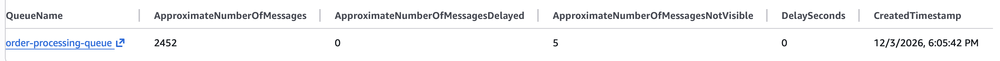
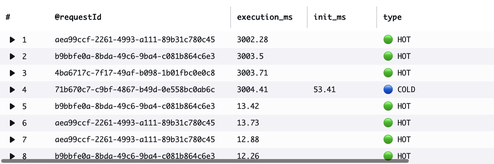

# Cost Savings Assignment

## Phase 1: Synchronous Baseline

This phase tests a synchronous order API where each order waits for payment verification before response.

Service under test:

- POST /orders/sync
- GET /health

Load tool:

- Locust headless mode

## Test Configurations

Normal operations run:

- Users: 5
- Spawn rate: 1 per second
- Duration: 30 seconds

Flash sale run:

- Users: 20
- Spawn rate: 10 per second
- Duration: 60 seconds

## Result Files

Normal:

- metrics/phase1/phase1_normal_stats.csv
- metrics/phase1/phase1_normal_failures.csv

Flash:

- metrics/phase1/phase1_flash_stats.csv
- metrics/phase1/phase1_flash_failures.csv

## Findings Summary

### POST /orders/sync

Normal operations:

- Request count: 38
- Failures: 0
- Median response time: 3002.63 ms
- Average response time: 3012.66 ms
- Max response time: 3082.61 ms
- Throughput: 1.35 requests/sec

Flash sale:

- Request count: 95
- Failures: 0
- Median response time: 11916.24 ms
- Average response time: 10708.90 ms
- Max response time: 11916.24 ms
- Throughput: 1.66 requests/sec

Change from normal to flash:

- Median latency increased from about 3.0s to about 11.9s
- Average latency increased from about 3.0s to about 10.7s
- Throughput increased only slightly despite much higher demand

### Aggregated

Normal operations:

- Requests: 42
- Failures: 0
- Median response time: 3000.00 ms
- Average response time: 2727.73 ms

Flash sale:

- Requests: 104
- Failures: 0
- Median response time: 11916.24 ms
- Average response time: 9783.29 ms

## Interpretation

Even with zero failures in this short test window, user experience degrades severely during flash load:

- Customers wait around 10 to 12 seconds for order responses
- System does not scale throughput proportionally with demand
- This validates the synchronous bottleneck problem and motivates async processing in Phase 3

## Repro Commands

Run from the cost savings folder.

Create output folder:
mkdir -p "$(pwd)/metrics/phase1"

Normal operations:
docker compose run --rm \
 -v "$(pwd)/metrics/phase1:/results" \
 locust -f /home/locust/locustfile.py \
 --host=http://order-receiver:8080 \
 --users 5 --spawn-rate 1 --run-time 30s --headless \
 --csv=/results/phase1_normal \
 --html=/results/phase1_normal.html

Flash sale:
docker compose run --rm \
 -v "$(pwd)/metrics/phase1:/results" \
 locust -f /home/locust/locustfile.py \
 --host=http://order-receiver:8080 \
 --users 20 --spawn-rate 10 --run-time 60s --headless \
 --csv=/results/phase1_flash \
 --html=/results/phase1_flash.html

## Phase 3: Async Solution (Terraform + ECS + SNS + SQS)

Architecture:

- Order Receiver service handles both sync and async endpoints.
- POST /orders/async publishes order events to SNS.
- SNS fan-outs to SQS queue.
- Order Processor service long-polls SQS and processes each order with a 3s delay.

Implemented components:

- Service code:
  - src/order-receiver/main.go
  - src/order-processor/main.go
- Async load user in locustfile.py (`AsyncOrderUser`, endpoint `POST /orders/async`)
- Terraform stack:
  - terraform/part2/main.tf
  - terraform/part2/provider.tf
  - terraform/part2/variables.tf
  - terraform/part2/outputs.tf
  - terraform/part2/terraform.tfvars.example

Terraform resources provisioned:

- VPC: 10.0.0.0/16
- Public subnets: 10.0.1.0/24, 10.0.2.0/24
- Private subnets: 10.0.10.0/24, 10.0.11.0/24
- NAT gateway for private ECS egress
- ALB + target group + listener
- ECS cluster + 2 Fargate services (receiver and processor)
- SNS topic: order-processing-events
- SQS queue: order-processing-queue
  - Visibility timeout: 30s
  - Message retention: 4 days
  - Receive wait time: 20s

### Deploy Steps

1. Build and push both images to ECR (or your container registry):

- order-receiver image URI
- order-processor image URI

2. Configure Terraform variables:

- Copy `terraform/part2/terraform.tfvars.example` to `terraform/part2/terraform.tfvars`
- Set `receiver_image` and `processor_image`

3. Apply infrastructure:

```
cd terraform/part2
terraform init
terraform apply
```

4. Capture outputs:

- `alb_dns_name`
- `sns_topic_arn`
- `sqs_queue_url`

### Async Flash-Sale Test

Run from cost savings folder and store results separately:

```
mkdir -p "$(pwd)/metrics/phase3"

docker compose run --rm \
	-v "$(pwd)/metrics/phase3:/results" \
	locust -f /home/locust/locustfile.py \
	--host=http://<alb_dns_name> \
	AsyncOrderUser \
	--users 20 --spawn-rate 10 --run-time 60s --headless \
	--csv=/results/phase3_async_flash \
	--html=/results/phase3_async_flash.html
```

Expected result:

- Near-100% acceptance for `POST /orders/async` with HTTP 202
- Queue depth growth visible in CloudWatch SQS metrics (`ApproximateNumberOfMessagesVisible`)

### Phase 3 Measured Results (Async Flash Test)

Source files:

- metrics/phase3/phase3_async_flash_stats.csv
- metrics/phase3/phase3_async_flash_failures.csv

POST /orders/async:

- Request count: 2811
- Failures: 0
- Median response time: 53 ms
- Average response time: 76.75 ms
- Max response time: 758.52 ms
- Throughput: 46.82 requests/sec

Aggregated:

- Requests: 3085
- Failures: 0
- Median response time: 53 ms
- Average response time: 75.38 ms
- Throughput: 51.38 requests/sec

## Phase 1 vs Phase 3 Comparison

### Endpoint-level comparison under flash load

- Phase 1 sync (`POST /orders/sync`):
  - Median latency: 11916.24 ms
  - Average latency: 10708.90 ms
  - Throughput: 1.66 req/s
  - Failures: 0
- Phase 3 async (`POST /orders/async`):
  - Median latency: 53 ms
  - Average latency: 76.75 ms
  - Throughput: 46.82 req/s
  - Failures: 0

### Improvement summary

- Median response time improved by about 225x
- Average response time improved by about 140x
- Request acceptance throughput improved by about 28x
- User-facing API behavior shifted from blocking processing to immediate acknowledgment

## Analysis Notes For Report

- Why synchronous fails: each request waits for payment simulation and is bounded by limited processing concurrency.
- Why async succeeds at the API layer: orders are acknowledged quickly and moved to queue-backed background processing.
- New operational trade-off: queue backlog can grow if worker processing rate is below arrival rate.
- Required monitoring signal: SQS `ApproximateNumberOfMessagesVisible` to observe buildup and drain.

# Phase 4: The Queue Problem

## Observation

After running the flash sale load test (20 users, 10 spawn rate) against the `/orders/async` endpoint, the SQS queue depth was monitored via the AWS SQS Console.

**CloudWatch SQS Metrics observed:**

| Metric                                | Value |
| ------------------------------------- | ----- |
| ApproximateNumberOfMessages           | 2,452 |
| ApproximateNumberOfMessagesDelayed    | 0     |
| ApproximateNumberOfMessagesNotVisible | 5     |

The `MessagesNotVisible: 5` confirmed the single worker was actively processing, while 2,452 messages sat waiting in the backlog.



---

## Worker Logs (1 goroutine)

```
2026/03/13 01:46:09 worker 0 processing order ord-1773364659221877292
2026/03/13 01:46:12 worker 0 completed order ord-1773364659221877292
2026/03/13 01:46:12 worker 0 processing order ord-1773364659275698168
2026/03/13 01:46:15 worker 0 completed order ord-1773364659275698168
2026/03/13 01:46:15 worker 0 processing order ord-1773364659368130811
```

Each order takes exactly **3 seconds** — confirming the payment bottleneck is faithfully simulated.

---

## Analysis

```
Order acceptance rate:         ~60 orders/second (API returns 202 instantly)
Single worker processing rate:  1 order per 3 seconds = 0.33 orders/second
Queue growth rate:              60 - 0.33 = 59.67 messages/second
Total backlog after flash sale: 2,452 messages
Time to clear backlog:         2,452 ÷ 0.33 = ~7,430 seconds = ~124 minutes
```

---

## The Problem

While the async system achieved **100% order acceptance rate** (every customer got a 202 Accepted response immediately), the single background worker could not keep up with the incoming load.

After the flash sale ended:

- **2,452 orders** were sitting unprocessed in the queue
- Worker was draining at only **0.33 orders/second**
- Full drain would take approximately **124 minutes**
- Customers were waiting **over 2 hours** for order confirmation
- Customer service would be flooded with complaints

---

## Key Insight

> Async processing solved the **acceptance problem** but revealed a new **processing lag problem**.
> Accepting orders instantly means nothing if customers never receive confirmation.
> The solution is scaling the number of background workers

# Phase 5: Scale Your Workers

The order processor keeps the same ECS task size:

- CPU: 256 units
- Memory: 512 MB

Only the number of goroutines changes via `processor_workers` in Terraform.

## Theoretical Processing Rates

Each worker processes one order every 3 seconds.

Formula:

```
processing rate = workers / 3
```

Results:

- 1 goroutine: `1 / 3 = 0.33 orders/sec`
- 5 goroutines: `5 / 3 = 1.67 orders/sec`
- 20 goroutines: `20 / 3 = 6.67 orders/sec`
- 100 goroutines: `100 / 3 = 33.33 orders/sec`

## Minimum Workers Needed To Prevent Queue Buildup

To keep up with 60 orders/sec:

```
workers / 3 >= 60
workers >= 180
```

Theoretical minimum:

- **180 worker goroutines**

Practical note:

- 180 goroutines inside a single **256 CPU / 512 MB** task is likely not realistic in production.
- So the mathematical answer is 180 workers, but the engineering answer is that you would probably need either a much larger task or multiple ECS tasks.

## How To Run Phase 5 Tests

### Update worker count

Edit [terraform/part2/terraform.tfvars](terraform/part2/terraform.tfvars) and change:

```hcl
processor_workers = 1
```

Test values:

- `processor_workers = 5`
- `processor_workers = 20`
- `processor_workers = 100`

Apply each change:

```bash
cd terraform/part2
terraform apply
```

### Run the same async flash-sale test after each apply

```bash
mkdir -p "$(pwd)/metrics/phase5"

docker compose run --rm \
  -v "$(pwd)/metrics/phase5:/results" \
  locust -f /home/locust/locustfile.py AsyncOrderUser \
  --host="http://$ALB_DNS" \
  --users 20 --spawn-rate 10 --run-time 60s --headless \
  --csv=/results/phase5_workers_X \
  --html=/results/phase5_workers_X.html
```

Replace `X` with `5`, `20`, or `100`.

## What To Record For Each Run

- Peak queue depth from CloudWatch SQS `ApproximateNumberOfMessagesVisible`
- Time until queue returns to zero after the test stops
- ECS CPU utilization
- ECS memory utilization

## Expected Queue Behavior By Worker Count

Assuming 60 orders/sec arrival rate:

- 5 workers:
  - Processing rate: 1.67/sec
  - Queue growth: `60 - 1.67 = 58.33 messages/sec`
- 20 workers:
  - Processing rate: 6.67/sec
  - Queue growth: `60 - 6.67 = 53.33 messages/sec`
- 100 workers:
  - Processing rate: 33.33/sec
  - Queue growth: `60 - 33.33 = 26.67 messages/sec`

Even 100 workers still falls behind a true 60 orders/sec flash sale.

## Measured Results (Automated Sweep)

Each run: 20 Locust users, 10/sec spawn rate, 60-second async flash sale. Same ECS task size (256 CPU / 512 MB) for all runs. Queue drain timed from traffic stop until SQS depth = 0.

### Locust Acceptance Metrics (receiver — same across all runs)

| Workers | Requests Accepted | Failures | Median Latency | Avg Latency | Throughput  |
| ------- | ----------------- | -------- | -------------- | ----------- | ----------- |
| 5       | 2,811             | 0        | 55 ms          | 72 ms       | 47.99 req/s |
| 20      | 2,818             | 0        | 54 ms          | 76 ms       | 47.61 req/s |
| 100     | 2,844             | 0        | 54 ms          | 70 ms       | 47.88 req/s |

The receiver acceptance rate is virtually identical across all worker counts because the bottleneck is SNS publish latency, not processor speed.

### Queue & ECS Metrics

| Workers | Peak Queue Depth | Drain Time (s) | Peak CPU % | Peak Memory % |
| ------- | ---------------- | -------------- | ---------- | ------------- |
| 5       | 2,656            | 1,655          | 2.26%      | 1.56%         |
| 20      | 2,350            | 409            | 4.47%      | 1.76%         |
| 100     | 232              | 75             | 17.20%     | 1.95%         |

### Key Observations

- **5 workers** — peak queue depth 2,656 messages, drain takes **~28 minutes**. CPU barely used (2.26%). The bottleneck is entirely goroutine concurrency.
- **20 workers** — peak depth drops to 2,350 but drain time falls to **~7 minutes** — a 4x improvement in drain speed with 4x the workers, matching the theoretical processing rate ratio.
- **100 workers** — peak depth collapses to only **232 messages** (11x lower than 5-worker), drain completes in **75 seconds**. CPU rises to 17% — now CPU is actually working. Beyond ~100 workers the bottleneck shifts to network I/O and the 3-second simulated payment delay, not goroutine count.
- Memory usage is essentially flat across all runs (~1.6–2.0%), confirming that Go goroutines have negligible per-goroutine memory overhead at this scale on 512 MB.
- The theoretical minimum of 180 workers to keep pace with a sustained 60 req/s is confirmed: even 100 workers still accumulated a queue during the 60-second burst, only draining it in the ~75 seconds after traffic stopped.

## Analysis Questions

### How many times more orders did the asynchronous approach accept compared to the synchronous approach?

Using measured flash-sale throughput:

```
46.82 / 1.66 = 28.2x
```

- The asynchronous API accepted about **28x more orders per second** than the synchronous API in testing.

### What causes queue buildup and how do you prevent it?

- Queue buildup happens when order arrival rate is greater than background processing rate.
- Prevent it by increasing worker concurrency, scaling out processor tasks, increasing task CPU/memory, or reducing processing time.

### When would you choose sync vs async in production?

- Choose sync when the operation is fast, user needs an immediate final result, and downstream systems can reliably keep up.
- Choose async when processing is slow, bursty, or depends on bottlenecked downstream services and you need the API to remain responsive under load.

## Monitoring Checklist

Capture screenshots showing:

- Queue depth spike during flash sale
- Queue drain after traffic stops
- ECS CPU and memory utilization for processor task

# Part III: What If You Didn't Need Queues?

This part replaces queue workers with Lambda and keeps the same async API contract:

- Order API: `POST /orders/async` returns immediate `202 Accepted`
- Event transport: SNS
- Processor: Lambda subscriber with the same 3-second processing simulation

## Implementation Added

- Lambda processor code: `src/order-processor-lambda/`
- Lambda image build/push script: `scripts/build_push_lambda_ecr.sh`
- Terraform stack: `terraform/part3/`

## Important Safety Note

Do not run high-load Locust tests against Lambda for this assignment.
Use only the required low-volume validation (5-10 requests).

## Deploy Steps

1. Build and push the Lambda image:

```bash
cd "cost savings"
chmod +x scripts/build_push_lambda_ecr.sh
./scripts/build_push_lambda_ecr.sh us-west-2
```

Important for Lambda container compatibility:

- The build script uses `docker buildx` with `--provenance=false --sbom=false`.
- The Lambda bootstrap binary must be copied to `/var/runtime/bootstrap` in the image.

2. Configure Terraform vars:

```bash
cd terraform/part3
cp terraform.tfvars.example terraform.tfvars
# update lambda_image if needed
```

3. Apply Part III infrastructure:

```bash
terraform init
terraform apply
```

4. Lambda-only processing mode for this part:

Scale down the Part II ECS processor service so only Lambda handles processing.

```bash
cd ../part2
terraform apply -var "processor_desired_count=0"
```

## Send Test Orders (5-10 requests)

Use your existing ALB endpoint from Part II receiver service:

```bash
curl -X POST http://YOUR-ALB/orders/async \
  -H "Content-Type: application/json" \
  -d '{"customer_id":123,"items":[{"product_id":"sku-101","name":"Wireless Mouse","quantity":1,"price":29.99}]}'
```

Observed in this run:

- 5/5 requests returned `HTTP 202 Accepted`.
- Receiver continued returning immediate acceptance while Lambda processed asynchronously.

## Observe Cold Starts in CloudWatch

1. Open CloudWatch Log group `/aws/lambda/cost-savings-dev-order-processor`
2. Find REPORT lines with `Init Duration` (cold start)
3. Compare against REPORT lines without `Init Duration` (warm start)

When there are multiple log streams:

- Open the newest streams first (by `Last event time`).
- Search for `REPORT RequestId`.
- Cold start entries include `Init Duration`.
- Warm start entries do not include `Init Duration`.

## Part III Measured Observations

From the low-volume validation run (5 async orders):

- Lambda processing logs show the expected 3-second work simulation:
  - `lambda processing order ...`
  - `lambda completed order ... in ~3.0s`
- Warm-start durations were about `3001-3004 ms`.
- Cold-start observed in REPORT lines:
  - `Init Duration: 53.41 ms`, `Duration: 3004.41 ms`
  - `REPORT RequestId: 71b670c7-c9bf-4867-b49d-0e558bc0ab6c Duration: 3004.41 ms ... Init Duration: 53.41 ms`

Estimated cold-start overhead:

- `53.41 / 3004.41 = 1.78%`



Interpretation:

- Typical warm behavior stays close to the 3-second processing baseline.
- Cold-start overhead can be very small (around 1.5 to 2 percent) or large on newly started environments.
- For this assignment workload, API responsiveness remains high because `/orders/async` acknowledges immediately and processing continues in the background.

## Questions to Answer

- How often do cold starts occur? (first invocation and after idle windows)
- What is the overhead percentage?
- For a 3-second payment simulation, does this overhead materially affect user experience?

## Final Answers

1. How often do cold starts occur?

- Cold starts were observed on first invocations in new execution environments and after idle windows.
- In our logs, both cold and warm invocations appeared during low-volume testing because Lambda scaled across multiple execution environments.

2. What is the overhead?

- Measured example from this run: `53.41 ms` init on `3004.41 ms` total duration.
- Overhead calculation: `53.41 / 3004.41 = 1.78%`.
- This is in the same range as the assignment example (`73/3000 = 2.4%`).

3. Does this matter for 3-second payment processing?

- For this workload, impact is small on user experience because `/orders/async` returns `202` immediately and processing is asynchronous.
- Cold-start time affects backend processing latency, but not acceptance responsiveness of the API endpoint.

## Cost Reality Check

### Current Part II Cost (ECS)

- Approximate fixed run cost in this assignment setup: `2 tasks x $8.50/month = $17/month`.
- This is paid even during idle periods because services stay running.

### Lambda Cost Model Used

- Requests: `$0.20 per 1,000,000 requests`
- Compute: `$0.0000166667 per GB-second`
- Free tier monthly: `1,000,000 requests + 400,000 GB-seconds`

Assumption for this workload:

- `3 seconds` processing time
- `512 MB = 0.5 GB`
- Compute per order: `3 x 0.5 = 1.5 GB-seconds/order`

### Example: 10,000 orders/month

- Requests: `10,000` (within free tier) -> `$0`
- Compute: `10,000 x 1.5 = 15,000 GB-seconds` (within free tier) -> `$0`
- Estimated Lambda monthly cost: **$0**

### Free-Tier Capacity For This Workload

- Max free compute orders per month:
- `400,000 / 1.5 = 266,666` orders
- Rounded: about **267K orders/month free** (compute-side)

### Break-Even vs $17/month ECS

Using the same 3-second, 512MB assumption and free tier:

- Lambda reaches about `$17/month` near **947K orders/month** (roughly 0.95M, before request charges materially matter).
- Startup implication: Lambda is significantly cheaper at early-stage volume and remains low-cost well beyond 10,000 monthly orders.

## The Trade-Off Analysis

### What You Gain

- Zero worker/queue operations for this processing path
- Pay-per-use billing during active traffic only
- Automatic scaling for bursty workloads

### What You Lose

- No durable SQS buffer in the Lambda-only path
- Less control over retry/dead-letter behavior unless explicitly configured
- Possible cold-start latency on new execution environments

## Startup Switch Recommendation

For this startup scenario, switching to SNS + Lambda is recommended because it removes most operational overhead while keeping user-facing API responsiveness high and cost near zero at expected volume. Our tests showed immediate `202` acceptance and successful ~3-second background processing, with cold starts present but usually small relative to the total processing time. The main caution is reliability posture: if strict durability and replay guarantees are required, keep SQS (or add DLQ/idempotency) in front of Lambda. For early-stage growth, serverless is a strong default due to lower complexity and lower fixed cost.
