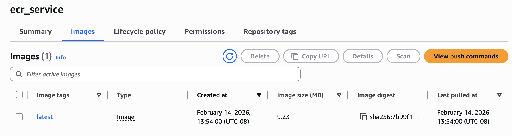
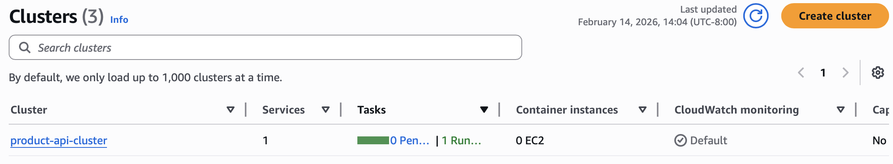
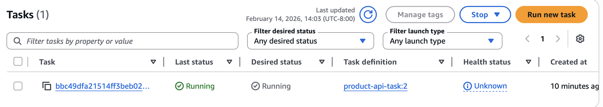

## Product API (HW5)

This service implements the Product endpoints from the OpenAPI specification in api.yaml. It provides an in-memory product store with basic validation.

### Requirements

- Go 1.20+ (or any recent Go version supported by your setup)

### Run

```bash
go run main.go
```

The server listens on port 8080.

### Endpoints

- `GET /products/{productId}`
- `POST /products/{productId}/details`

### Example Requests

**Create or update a product:**

```bash
curl -X POST http://localhost:8080/products/1/details \
  -H "Content-Type: application/json" \
  -d '{
    "product_id": 1,
    "sku": "ABC-123-XYZ",
    "manufacturer": "Acme Corporation",
    "category_id": 456,
    "weight": 1250,
    "some_other_id": 789
  }'
```

Expected response: `204 No Content`

**Fetch a product:**

```bash
curl http://localhost:8080/products/1
```

Expected response:

```json
{
  "product_id": 1,
  "sku": "ABC-123-XYZ",
  "manufacturer": "Acme Corporation",
  "category_id": 456,
  "weight": 1250,
  "some_other_id": 789
}
```

**Error handling examples:**

```bash
# Invalid product ID
curl http://localhost:8080/products/0
# Response: {"error":"INVALID_INPUT","message":"Invalid product ID","details":"Product ID must be a positive integer"}

# Missing required field
curl -X POST http://localhost:8080/products/1/details \
  -H "Content-Type: application/json" \
  -d '{"product_id":1,"manufacturer":"Test"}'
# Response: {"error":"INVALID_INPUT","message":"Invalid input data","details":"sku is required and cannot be empty"}

# Invalid weight
curl -X POST http://localhost:8080/products/1/details \
  -H "Content-Type: application/json" \
  -d '{"product_id":1,"sku":"TEST","manufacturer":"Test","category_id":1,"weight":-100,"some_other_id":1}'
# Response: {"error":"INVALID_INPUT","message":"Invalid input data","details":"weight must be greater than or equal to 0"}
```

### Notes

- Data is stored in memory and resets when the server restarts.
- Validation follows the constraints defined in api.yaml.
- Product IDs must be positive integers.
- SKU and manufacturer are required fields with length constraints.

## Docker Build and Local Testing

Build the Docker image:

```bash
cd src/
docker build -t product-api .
```

Run locally:

```bash
docker run -p 8080:8080 product-api
```

Expected output:

```
Product API Server starting on port :8080
Endpoints:
  GET    /products/{productId}
  POST   /products/{productId}/details
```

Test locally:

```bash
# Add a product
curl -X POST http://localhost:8080/products/12345/details \
  -H "Content-Type: application/json" \
  -d '{"product_id":12345,"sku":"ABC-123-XYZ","manufacturer":"Acme Corporation","category_id":456,"weight":1250,"some_other_id":789}'

# Get the product
curl http://localhost:8080/products/12345
```

## AWS Deployment with Terraform

### Prerequisites

- AWS CLI configured with valid credentials
- Terraform installed
- Docker installed

### Infrastructure Overview

The Terraform configuration deploys:

- **ECR Repository**: Stores the Docker image
- **ECS Cluster**: `product-api-cluster` running on Fargate
- **VPC/Networking**: Uses default VPC with security group allowing port 8080
- **CloudWatch Logs**: `/ecs/product-api` log group

### Deploy to AWS

1. **Navigate to terraform directory:**

```bash
cd terraform/
```

2. **Initialize Terraform:**

```bash
terraform init
```

3. **Review the deployment plan:**

```bash
terraform plan
```

4. **Deploy the infrastructure:**

```bash
terraform apply
```

Type `yes` when prompted. This will:

- Create ECR repository
- Build Docker image for AMD64/x86_64 architecture
- Push image to ECR
- Create ECS cluster and service
- Deploy container on Fargate





5. **Get the public IP of your running task:**

```bash
# List running tasks
aws ecs list-tasks --cluster product-api-cluster --region us-west-2

# Get task details and public IP
TASK_ARN=$(aws ecs list-tasks --cluster product-api-cluster --region us-west-2 --query 'taskArns[0]' --output text)

aws ecs describe-tasks --cluster product-api-cluster --tasks $TASK_ARN --region us-west-2 \
  --query 'tasks[0].attachments[0].details[?name==`networkInterfaceId`].value' --output text | \
  xargs -I {} aws ec2 describe-network-interfaces --network-interface-ids {} --region us-west-2 \
  --query 'NetworkInterfaces[0].Association.PublicIp' --output text
```

6. **Test the deployed API:**

```bash
# Replace <PUBLIC_IP> with the actual IP from step 5
PUBLIC_IP=<your-task-public-ip>

# Test endpoints
curl http://$PUBLIC_IP:8080/products/1

curl -X POST http://$PUBLIC_IP:8080/products/1/details \
  -H "Content-Type: application/json" \
  -d '{"product_id":1,"sku":"ABC-123","manufacturer":"Acme","category_id":456,"weight":1250,"some_other_id":789}'

curl http://$PUBLIC_IP:8080/products/1
```

### View Logs

```bash
# Tail recent logs
aws logs tail /ecs/product-api --region us-west-2 --since 10m --follow

# View logs in AWS Console
# Navigate to CloudWatch > Log groups > /ecs/product-api
```

### Cleanup

To destroy all AWS resources:

```bash
cd terraform/
terraform destroy
```

Type `yes` when prompted.

### Troubleshooting

**Container fails with "exec format error":**

- Ensure Dockerfile builds for AMD64: `GOARCH=amd64`
- Force rebuild: `terraform destroy -target=docker_image.app -auto-approve && terraform apply -auto-approve`

**Task keeps restarting:**

- Check logs: `aws logs tail /ecs/product-api --region us-west-2 --since 5m`
- Verify task status: `aws ecs describe-tasks --cluster product-api-cluster --tasks <task-arn> --region us-west-2`

**Port 8080 already in use locally:**

- Stop existing process: `lsof -i :8080` then `kill <PID>`
- Or use different port: `docker run -p 8081:8080 product-api`
